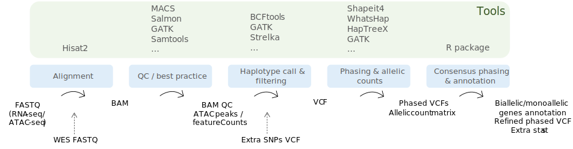

```{r, include = FALSE}
knitr::opts_chunk$set(
  collapse = TRUE,
  comment = "#>",
  fig.width=6, fig.height=4
)
```

```{r setup}
library(ASTRA)
library(EnsDb.Hsapiens.v86)
```

# Introduction

ASTRA R package permits the analysis of the transcriptional landscape of a gene. This package is comprised in the ASTRA pipeline that permits the analysis of Allele Specific Expression and Allele Specific Accessibility starting from raw sequencing data.

{width="590"}

# Data Load

### Set up all the needed files and IDs.

In fact **ASTRA** will process one chromosome at the time that needs to be specified in the following chunk and moreover the sample ID, to individuate the *.vcf* column informative.

```{r}
chrom=14
sample="BJ"
```

BioMart - Ensembl is used to extract genes information, the function *biomart_df()* set up the biomart dataframe as needed by the following function. Change the mart dataset if needed and the gene expanding window.

```{r}
BM <- annotationhub_df()
BMsel<-BM[BM$chromosome_name==chrom,]

head(BMsel)
```

To read in phasing results in the SHAPEIT4/vcf.gz format is available the function *read_shapeit()* while to read phasing results in the HapTree-X format (see <https://github.com/0xTCG/haptreex#output>) is available the function *read_haptreex()*. Below an example for both the data types.

```{r}
df_sh_all<-read_shapeit(
  variant_calling_out_path = system.file("extdata", "snps_het.vcf.gz", package = "ASTRA"),
  phased_out_path = system.file("extdata", "shapeit_whatshap.vcf.gz", package = "ASTRA"),
  sample_name =sample)

df_sh<-df_sh_all[df_sh_all$CHROM%in%chrom,]
head(df_sh)

df_hp_all<-read_haptreex(
  variant_calling_out_path = system.file("extdata", "snps_het.vcf.gz", package = "ASTRA"),
  phased_out_path = system.file("extdata", "haptreex.tsv", package = "ASTRA"),
  sample_name =sample)

df_hp<-df_hp_all[df_hp_all$CHROM%in%chrom,]
head(df_hp)
```

# Phasing: consensus and refinement

### Consensus phasing and manual refinement based on ASE results

At this point of the analysis we can put together the two phasing results (i.e. SHAPEIT4 and HapTree-X in this example) using a **consensus phasing** approach.

```{r}
olaps <- conshap(df1=df_sh,df2 = df_hp,BMsel = BMsel,DF1="WShapeit",DF2="HapTreeX")
```

Next we can add Allele Specific Expression info for the manual refinement. Use gatk ASEReadCounter to compute ASE from bulk/pseudo-bulk RNA-seq. Filters for SNPs on genes having at least *reads* supporting it (default reads=2) and overall depth (*totalCount*) \>= od. Next SNPs will be categorized as biallelic/monoallelic based on the Reference Fraction (RF=reference count/overall reads count) value and filtered accordingly to obtain the final gene annotation.

```{r}
df_ASE<-addASE(
  df_var = olaps,ASE_path = system.file("extdata", "rna.table", package = "ASTRA"),
  BM = BMsel,reads=0,od = 10)
head(df_ASE)

df_SNPs<-biallmonoall(df_ASE)

df_PHASED<-manualP(df_SNPs)
df_PHASED$tech<-""
saveRDS(df_PHASED,"ASTRAresults.rds")
```

# Plotting

### Final plotting of single gene Allele Specific Expression profile

Plot of the allelic ratio (from 0 to 1, 0.5 indicating a 1 to 1 ratio of a1 and a2) for each SNPs of the selected genes.

```{r}
p<-plot_ase(df=df_PHASED,genes_to_plot=c("MEG3"),"Final phasing result MEG3 gene")
if(!is.null(p))
  {plot(p)}
```

In the following is instead a radar plot of all the genes categorized as monoallelic/biallelic, annotated for the preferred category (i.e. the gene biotype).

```{r}
#add a column with your preferred annotation to the final phased df. 
df_ann<-merge(df_PHASED,BMsel[,c("ensembl_gene_id","gene_biotype")],by=c("ensembl_gene_id"))
#Be sure to not have double genes.
df_ann<-unique(df_ann[,c("ensembl_gene_id","type","gene_biotype")])

#plot function:
plot_annotation(df=df_ann,ASC="type",gene="ensembl_gene_id",annotation="gene_biotype")
```

Similar to the previous, but automatic annotation using msigbd. Just select preferred category and subcategory. More info typing *msigdbr_collections()*

```{r}
plot_msigdb(df_PHASED,ASC="type",gene="ensembl_gene_id")
```

# Integrate SEESAW

SEESAW vignette available here: <https://mikelove.github.io/Bioc2022AllelicExpression/articles/Bioc2022AllelicExpression.html>. It permits the ASE analysis at the isoform level. Our intention is to create an isoform specific expression analysis starting merging together ASTRA and SEESAW concepts.

```{r}
quantsf<-system.file("extdata", "seesawquant.sf", package = "ASTRA")

seesaw(names = sample, edb_id="AH113665",tss_gap=50,gene_id="ENSG00000214548",files=quantsf,cellline_id="bj")
```
